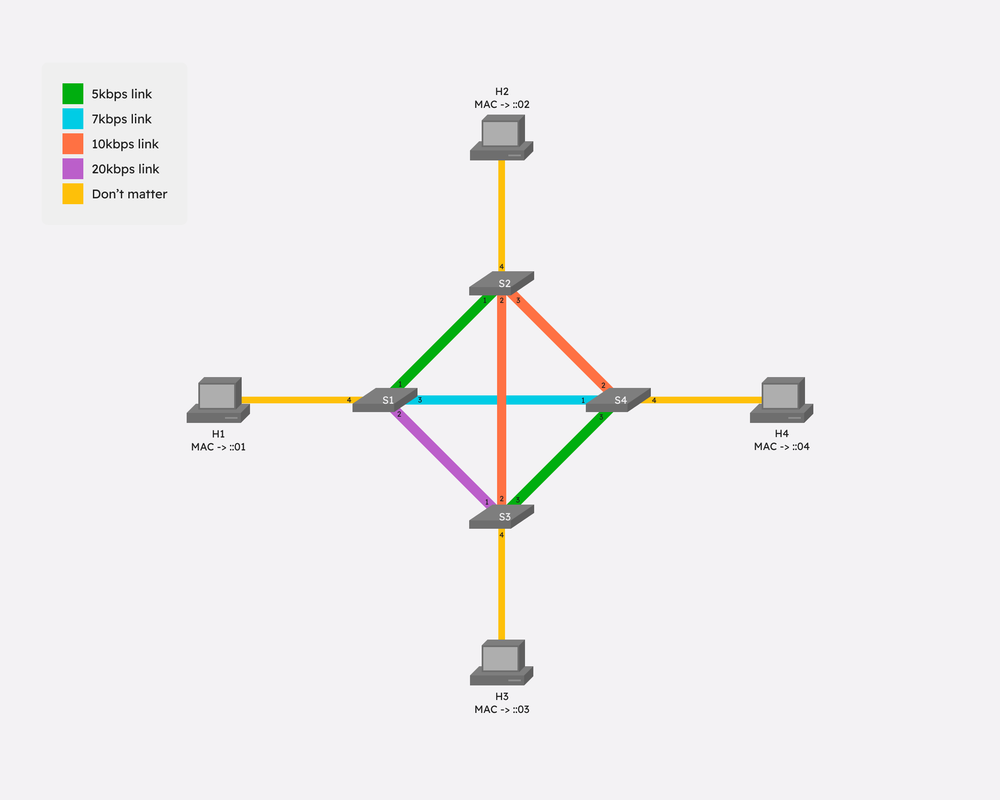
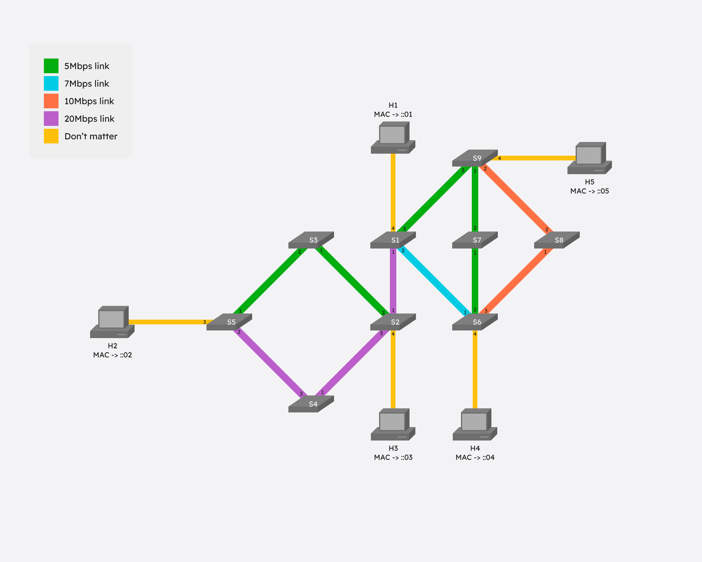
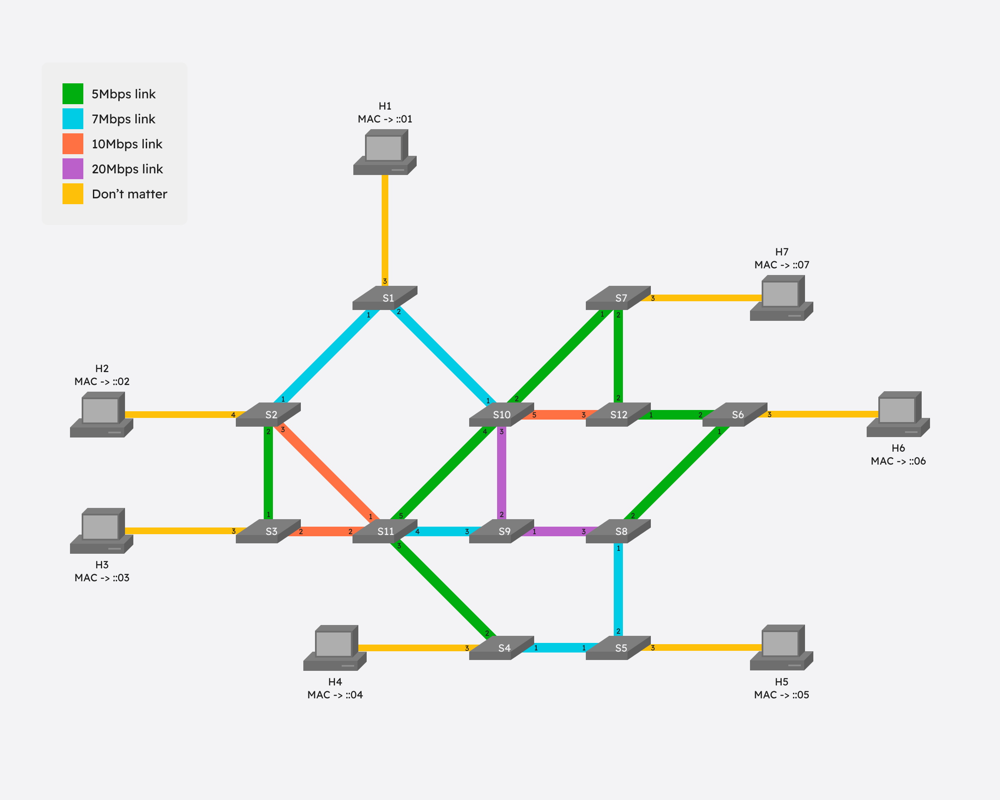

# SDN Network Slicing

## Table of Contents

-   [Introduction](#introduction)
-   [Installation](#installation)
-   [Repository structure](#repository-structure)
-   [Network Topology](#network-topology)
-   [Slicing controller commands](#slicing-controller-commands)
    -   [Add a flow](#add-a-flow)
    -   [Add a route](#add-a-route)
    -   [Delete a flow](#delete-a-flow)
    -   [Clear a switch](#clear-a-switch)
    -   [Show all flows](#show-all-flows)
    -   [Default configurator](#default-configurator)
-   [Testing](#testing)
    -   [Ping](#ping)
    -   [Iperf](#iperf)
-   [Testing setup example](#testing-setup-example)

## Introduction

This repository contains the project for the "Netx Generation Networks" (year 2024/2025) course @University of Trento. Authors: Facchinelli Davide, Pedrolli Daniele.

It is entirely based on the ComNetsEmu network emulator, which uses mininet to emulate the network and Ryu as the SDN controller. As recommended in the ComNetsEmu documentation,
it should be installed in a Vagrant managed VM. You can find the ComNetsEmu repository at the following link: https://git.comnets.net/public-repo/comnetsemu.

## Installation

Once ComNetsEmu is ready, it is suggested to ssh into it using the following command line:

```bash
vagrant up
vagrant ssh
```

After that, from within the Vagrant VM, the files should be downloaded by cloning the repository.

```bash
git clone https://github.com/pedwoo/SDN_network_slicing_project.git
```

The only thing left to complete the setup is entering the project directory. From here, on one terminal start the controller script, and on a second terminal window start the
client side of the project, specifying the which of the topologies to start.

```bash
# Terminal 1
ryu-manager Controller.py

# Terminal 2
# sudo python3 Client.py <topology: [a, b, c]>
sudo python Client.py a
```

Once the topology is started client side, it will send a GET request to a dedicated API endpoint in the controller to initialize the parameters connected to the specific
topology to be used by the controller. This endpoint doesn't have a dedicated command in the mininet CLI, as it is only intended to be used once, automatically, when first
instantiating the network topology.

## Repository structure

There are three main files that compose the project:

-   [Topology.py](topologies/Topology_a.py): Defines and runs the network topology, including the connection to the controller
-   [ExtendedCLI.py](utils/ExtendedCLI.py): Extends the default mininet CLI instance to implement custom commands
-   [Controller.py](Controller.py): Includes both the controller logic and the API endpoints

## Network Topology

The complete networks from a birds-eye view can be seen in the images below ([image folder here](./img)).

| Topology A                          | Topology B                          | Topology C                          |
| ----------------------------------- | ----------------------------------- | ----------------------------------- |
|  |  |  |

It is to be noted that the yellow links' capacity is labeled as "don't matter" since it is theoretically infinite, as they are the links between just the hosts and their
respective switches.

## Slicing controller commands

There are three custom commands that can be used directly from the mininet CLI. Their usage is as follows:

### **Add a flow**

```bash
# addflow <switch_name> <src_host_name> <dst_host_name> <port_in> <port_out> <priority> <bandwidth>
mininet> addflow s1 h1 h2 4 1 1 1
```

This command sends a GET request to the exposed API endpoint of the controller.  
The provided example will install a flow (with priority 1 and bandwidth of 1Mbps) on s1 that
will forward the packets incoming on port 4 (h1) out to port 1 (s2). It is to be
noted that in order to have a two-way connection between the hosts, two flow rules must be installed. Additionally, if we require a two-way 4Mbps connection, we need a link
with a bandwidth of at least 8Mbps.  
The reponse of the endpoint is defined as follows:

-   _Success_:
    -   200: Flow successfully allocated on switch {dpid} between {src_host} and {dst_host} with {bandwidth} Mbps
-   _Error_:
    -   401: Not enough capacity on the link
    -   404: No datapath found for switch {dpid}
    -   404: Failed to cotact RYU controller
    -   500: MAC address not found for source: {src_host}
    -   500: MAC address not found for destination: {dst_host}
    -   500: Unexpected error {error}

### **Add a route**

```bash
# addroute <src_host_name> <dst_host_name> <bandwidth>
mininet> addroute h1 h2 5
```

This command sends a GET request to the exposed API endpoint of the controller.  
The provided example will install flows in the network to allow the communication between h1 and h2 with a bandwidth of 5Mbps. The controller will calculate the shortest path.
The priority is automatically set to 1.  
The output of the command is defined as follows:

-   _Success_:
    -   200: Route successfully allocated between {src_host} and {dst_host} with {bandwidth} Mbps
-   _Error_:
    -   401: Not enough capacity on the link
    -   404: MAC address not found for source: {src_host}
    -   404: MAC address not found for destination: {dst_host}
    -   404: Failed to cotact RYU controller
    -   409: route already exists
    -   500: Unexpected error {error}

### **Delete a flow**

```bash
# remflow <switch_name> <src_host_name> <dst_host_name> <port_in> <port_out> <priority> <bandwidth>
mininet> remflow s1 h1 h2 4 1 1
```

This command sends a GET request to the exposed API endpoint of the controller, that will subsequently send a `OFPFC_DELETE` message to the switch where the flow is to be
removed.  
The output of the command is defined as follows:

-   _Success_:
    -   200: Flow removed from switch {dpid}
-   _Error_:
    -   404: No datapath found for switch {dpid}
    -   404: MAC address not found for source: {src_host}
    -   404: MAC address not found for destination: {dst_host}
    -   404: Failed to cotact RYU controller
    -   500: Unexpected error {error}

### **Clear a switch**

```bash
# clearsw <switch_name>
mininet> clear s1
```

This command sends a GET request to the exposed API endpoint of the controller, that will subsequently send a `OFPFC_DELETE` message to remove all flows installed on the
specified switch.  
The response of the endpoint is defined as follows:

-   _Success_:
    -   200: Switch {dpid} cleared
-   _Error_:
    -   404: No datapath found for switch {dpid}
    -   404: Failed to cotact RYU controller
    -   500: Unexpected error {error}

### **Show all flows**

```bash
# flows <switch_name>
mininet> flows s1
```

This command sends a GET request to the exposed API endpoint of the controller, to show all the flows installed on a specified switch. It is to be noted that the actual list of
flows is only shown on the controller's console.  
The response of the endpoint is defined as follows:

-   _Success_:
    -   200: Flow stat request sent to switch {dpid}
-   _Error_:
    -   404: No datapath found for switch {dpid}
    -   404: Failed to cotact RYU controller
    -   500: Unexpected error {error}

### **Default configurator**

```bash
# config <config_number>
mininet> config 0
```

This command sends a GET request to the exposed API endpoint of the controller to install one of the default configurations of the networks on the switches. It is to be noted
that it will also clear any pre-existing flow rules on any switch.  
Depending on the topology chosen, there are different configurations:

-   **Topology A**:
    -   _[0]_: All hosts are connected to all other hosts on 2Mbps bidirectional (4Mbps total) links.
    -   _[1]_: All hosta are connected to all other hosts with links of the maximum capacity allowd by the network.
    -   _[2]_:
        -   h3 and h4 are connected on a 4Mbps bidirectional (8Mbps total) link going through s2
        -   h3 and h2 are connected on a 1Mbps bidirectional (2Mbps total) link.
    -   _[3]_:
        -   h1 and h3 are connected on a 5Mbps bidirectional (10Mbps total) link
        -   h2 and h1 are connected on a 5Mbps bidirectional (10Mbps totla) link going through s3.
-   **Topology B**:
    -   _[0]_: Only configured flows on switches that have a host connected to them, based on the shortest path between the hosts. All links are 1Mbps bidirectional (2Mbps total)
        links
    -   _[1]_:
        -   h1 and h2 are connected on a 2Mbps bidirectional (4Mbps total) link through s2, s4
        -   h1 and h4 are connected on a 1Mbps bidirectional (2Mbps total) link through s9, s8
        -   h2 and h3 are connected on a 8Mbps bidirectional (16Mbps total) link through s4
        -   h3 and h4 are connected on a 2Mbps bidirectional (4Mbps total) link through s1
        -   h4 and h5 are connected on a 3Mbps bidirectional (6Mbps total) link through s8
-   **Topology C**:
    -   _[0]_: Only configured flows on switches that have a host connected to them, based on the shortest path between the hosts. All links are 1Mbps bidirectional (2Mbps total)
        links
    -   _[1]_:
        -   h1 and h6 are connected on a 1Mbps bidirectional (2Mbps total) link through s10, s12
        -   h2 and h5 are connected on a 1Mbps bidirectional (2Mbps total) link through s1, s10, s9, s8
        -   h2 and h7 are connected on a 2Mbps bidirectional (4Mbps total) link through s11, s10, s12
        -   h3 and h4 are connected on a 2Mbps bidirectional (4Mbps total) link through s11
        -   h3 and h7 are connected on a 1Mbps bidirectional (2Mbps total) link through s11, s10
        -   h4 and h5 are connected on a 1Mbps bidirectional (2Mbps total) link
        -   h4 and h6 are connected on a 2Mbps bidirectional (4Mbps total) link through s8, s5
    -   _[2]_:
        -   h2 and h5 are connected on a 3Mbps bidirectional (6Mbps total) link through s1, s10, s9, s8, s5
        -   h3 and h6 are connected on a 1Mbps bidirectional (2Mbps total) link through s11, s10, s12
        -   h4 and h7 are connected on a 2Mbps bidirectional (4Mbps total) link through s11, s10
        -   h4 and h5 are connected on a 3Mbps bidirectional (6Mbps total) link

The response of the endpoint is defined as follows:

-   _Success_:
    -   200: Configuration {config_number} successfully installed
-   _Error_:
    -   400: Invalid configuration number
    -   404: Failed to cotact RYU controller
    -   500: Failed to apply configuration {config_number}
    -   500: Unexpected error {error}

## Testing

Once the network is up and running, and the flows have been installed correctly, it is possible to test connectivity either by pinging the hosts or by using iperf.

### Ping

The ping test is used to check whether two host can communicate with each other by sending ICMP packets. Both of the following commands can be used to test the connection. The
second one will send only a single packet.

```bash
# <sender_host_name> ping <receiving_host_name>
mininet> h1 ping h2

# <sender_host_name> ping -c <number packets> <receiving_host_name>
mininet> h1 ping -c 1 h2
```

Alternatively, `pingall` can also be used to check connectivity from and to all hosts in the network. The result will vary based on the flows and/or the default configuration
installed in the network.  
For semplicity, all the results provided in the following tests will be done on configuration 0 of topology A.

### Iperf

`iperf` is used to check the capacity of the links being used by the communication, to make sure that the bandwidth constraints in the flows are being respected.  
Since there are no restrictions in place to send different types of packets along different paths, we can use a simple client-server setup to test the link between two
hosts.

In the mininet CLI, using the `&` to run the server in the background and input another command in the same terminal, we can run the iperf server on one host and the client on the
other.

```bash
# <sender_host_name> iperf -s &
# <receiving_host_name> iperf -c <sender_host_name>

mininet> h1 iperf -s &
mininet> h2 iperf -c h1


# Output:
------------------------------------------------------------
Client connecting to 10.0.0.1, TCP port 5001
TCP window size: 85.3 KByte (default)
------------------------------------------------------------
[  3] local 10.0.0.2 port 57530 connected with 10.0.0.1 port 5001
[ ID] Interval       Transfer     Bandwidth
[  3]  0.0-10.1 sec  6.00 MBytes  4.98 Mbits/sec
```

Note that the second command can be altered by using the `-t` flag to set the time of the test, or the `-i` flag to set the interval between reports. Bandwidths can also be set
manually for both the client and server using the `-b` flag (e.g. `-b 10M` for 10Mbps bandwidth) in the respective commands.

### Testing setup example

Below is a simple testing configuration, including installation of the flows and testing of the connection between two hosts. The example is done on topology A, with no default
configuration.

#### Flow installation

```bash
mininet> addflow s1 h1 h2 4 1 1 1 # Add flow on s1 from h1 to s2
STATUS: 200 | Flow successfully allocated on switch 1 between h1 and h2 with 1 Mbps
mininet> addflow s1 h2 h1 1 4 1 1 # Add flow on s1 from s2 to h1
STATUS: 200 | Flow successfully allocated on switch 1 between h2 and h1 with 1 Mbps
mininet> addflow s2 h1 h2 1 4 1 1 # Add flow on s2 from s1 to h2
STATUS: 200 | Flow successfully allocated on switch 2 between h1 and h2 with 1 Mbps
mininet> addflow s2 h2 h1 4 1 1 1 # Add flow on s2 from h2 to s1
STATUS: 200 | Flow successfully allocated on switch 2 between h2 and h1 with 1 Mbps
```

#### Ping setup

```bash
mininet> h1 ping -c 1 h2 # Test connection between h1 and h2
PING 10.0.0.2 (10.0.0.2) 56(84) bytes of data.
64 bytes from 10.0.0.2: icmp_seq=1 ttl=64 time=0.509 ms

--- 10.0.0.2 ping statistics ---
1 packets transmitted, 1 received, 0% packet loss, time 0ms
rtt min/avg/max/mdev = 0.509/0.509/0.509/0.000 ms
```

#### Iperf setup

```bash
mininet> h1 iperf -s &  # Start iperf server on h1
mininet> h2 iperf -c h1 # Start iperf client on h2
------------------------------------------------------------
Client connecting to 10.0.0.1, TCP port 5001
TCP window size: 85.3 KByte (default)
------------------------------------------------------------
[  3] local 10.0.0.2 port 57576 connected with 10.0.0.1 port 5001
[ ID] Interval       Transfer     Bandwidth
[  3]  0.0-10.2 sec  6.00 MBytes  4.95 Mbits/sec
```

```bash
mininet> h1 iperf -s -b 1M &   # Start iperf server on h1 with 1Mbps bandwidth
mininet> h2 iperf -c h1 -b 1M  # Start iperf client on h2 with 1Mbps bandwidth
------------------------------------------------------------
Client connecting to 10.0.0.1, TCP port 5001
TCP window size: 85.3 KByte (default)
------------------------------------------------------------
[  3] local 10.0.0.2 port 57616 connected with 10.0.0.1 port 5001
[ ID] Interval       Transfer     Bandwidth
[  3]  0.0-10.0 sec  1.38 MBytes  1.15 Mbits/sec
```
